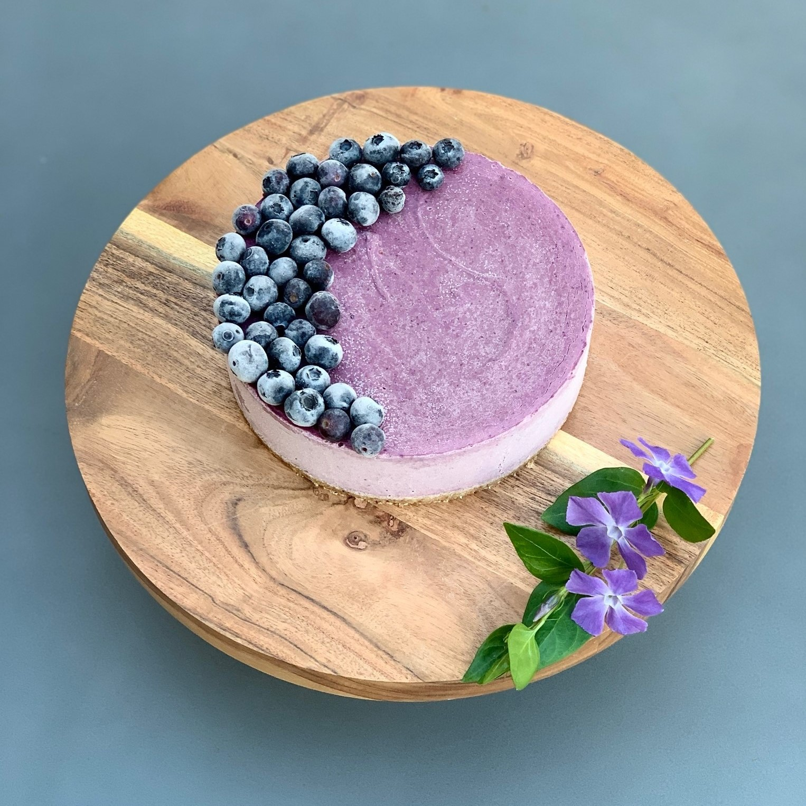

<!DOCTYPE html>
<html>
<head>

	<meta name="viewport" content="width=device-width, intial-scale=1">
	<meta name="description" content="Sweet Zen is dedicated to providing delicious plant-based desserts that are guilt-free and sustainable.">
  	<meta name="keywords" content="Vegan Dessert">
 	<meta name="author" content="Aaron Rad">
	<meta charset="utf-8">

	<title>Homepage</title>

	<link href="dist/css/lightbox.css" rel="stylesheet" />

	<link rel="stylesheet" type="text/css" href="website.css">
	

	

</head>
<body>

	

		

			

			

				
				

	

	

			

	

		<a href="#" class="bar"> Home</a>
		<a href="about.html" class="bar"> About</a>
		<a href="contact.html" class="bar"> Contact Us</a>

		
	

	

	Gallery
	

		

		

	
	

		
		

		

		
			
			

			Blueberry Cheesecake   $60.00 
			

			
		

		

		

		
			
			

			Coconut Chocolate Truffle
			 
			10 for $18.00
			 
			20 for $34.00
			

		
		

		

		

			

			Strawberry Cheesecake Cup 
			 
			$5.50 per Jar
			

		
		

		
		

		
			
			

			Key Lime Pie   $60.00 
			
 
			
		

		

		
			
			

			Chocolate Heart Cup   $3.00 each
			

			
		

		

		

			

			Blackberry Cheesecake   $60.00
			

			
		

<!--
		

		<a href="#" class="name">

		

			

			$$$$$$$$$$
			

			</a>
		

	-->
		

		

		

		
 Sweet ZenTM 2019

		

		
		

</body>
</html>
